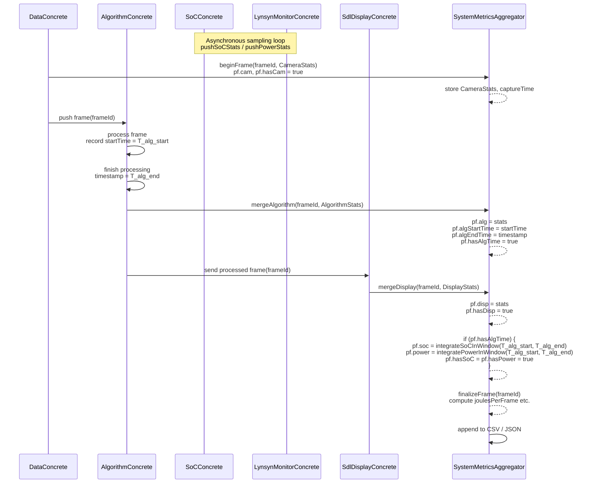
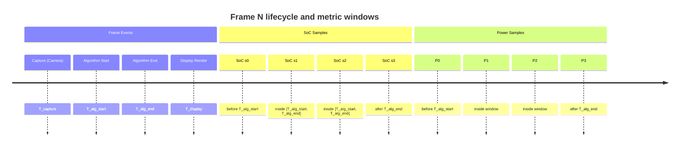

In that aggregator world, **two things happen** around this code:

```cpp
it->second.disp    = stats;
it->second.hasDisp = true;

// Check if we have a valid time window from the algorithm 
if (it->second.hasAlgTime) {
    // ... integrate SoC + Power in [algStartTime, algEndTime]
}
```

### 1. What the first part does

```cpp
it->second.disp    = stats;
it->second.hasDisp = true;
```

* `it->second` = the **PendingFrame** entry for this `frameId` inside the aggregator.
* `disp`       = the **DisplayStats** for that frame.
* `hasDisp`    = a **flag** telling the aggregator: “ok, the display module has now reported for this frame”.

So this is simply: **“attach the display metrics to this frame and mark them as present.”**

---

### 2. What the second part does

```cpp
if (it->second.hasAlgTime) {
    // use algStartTime / algEndTime to integrate SoC + Power
}
```

* `hasAlgTime` is true only if the **algorithm module** already told us:

  * `algStartTime` ? when processing for this frame started
  * `algEndTime`   ? when it ended

If `hasAlgTime == true`, the aggregator now has a **precise time window** for that frame’s computation:

> **Window for frame N** = `[algStartTime, algEndTime]`

Inside that `if` block, the aggregator calls:

* `integrateSoCInWindow(algStartTime, algEndTime)`
* `integratePowerInWindow(algStartTime, algEndTime)`

which:

* look into the **history buffers** (`socHistory_`, `powerHistory_`)
* take only samples in that time window (with clipping at start/end)
* compute **time-weighted averages** (SoC) and **energy / average power** (Power).

So the meaning is:

> “Now that display has arrived, if we already know the algorithm time window for this frame, compute SoC and Power only during the time when the algorithm was actually running.”

---

## Mermaid Diagrams – How SoC & Power integrate into the window

Below are a few diagrams you can paste directly into Mermaid-compatible tools (e.g. draw.io, VSCode plugin, Mermaid Live Editor).

---

### A. High-level pipeline & aggregator (component view)

```mermaid
flowchart LR
    subgraph Pipeline
        Data[DataConcrete\n(Camera Capture)]
        Alg[AlgorithmConcrete\n(Image Processing)]
        Disp[SdlDisplayConcrete\n(Display)]
    end

    subgraph Monitoring
        SoC[SoCConcrete\n(Jetson Metrics)]
        Power[LynsynMonitorConcrete\n(Power Board)]
    end

    subgraph Aggregator
        SMA[SystemMetricsAggregator\n(v3_2)]
    end

    Data -- CameraStats (beginFrame) --> SMA
    Alg  -- AlgorithmStats (mergeAlgorithm) --> SMA
    Disp -- DisplayStats (mergeDisplay) --> SMA

    SoC  -- SoC Samples\n(pushSoCStats) --> SMA
    Power -- Power Samples\n(pushPowerStats) --> SMA

    SMA -- Snapshots per frame\n(CSV / JSON) --> Out[(metrics_realtime.csv)]
```

* **Data**: starts frame lifecycle.
* **Algorithm**: sets `[algStartTime, algEndTime]`.
* **Display**: triggers SoC/Power integration + finalization.
* **SoC/Power modules**: continuously push async samples.

---

### B. Sequence diagram for a single frame (time flow)



Key idea: **Display’s `mergeDisplay` is the hook** where, if algorithm time exists, the aggregator:

1. Integrates SoC metrics over `[T_alg_start, T_alg_end]`
2. Integrates Power metrics over the same window
3. Finalizes the frame snapshot

---

### C. Window integration logic (focused on one frame)

This one is zoomed into the window and how samples are used.

```mermaid
flowchart TD
    A[AlgorithmStats for frame N<br/>startTime = T_alg_start<br/>endTime = T_alg_end] --> B{integrateSoCInWindow<br/>(T_alg_start, T_alg_end)}

    subgraph SoCIntegration
        B --> C[Copy socHistory_ -> histCopy]
        C --> D[Find last sample <= T_alg_start<br/>and first sample >= T_alg_end]
        D --> E[Build ordered samples list:<br/>before, inside, after]
        E --> F[For each adjacent pair (s1,s2):<br/>clip interval to [start,end]<br/>dt = t2 - t1]
        F --> G[Accumulate CPU/RAM * dt<br/>(trapezoidal rule)]
        G --> H[Divide by total_time_sec<br/>? avg CPU%, RAM<br/>SoC window stats]
    end

    H --> I[pf.soc = avg SoC stats]

    A --> J{integratePowerInWindow<br/>(T_alg_start, T_alg_end)}

    subgraph PowerIntegration
        J --> K[Copy powerHistory_ -> histCopy]
        K --> L[Build samples (before, inside, after)]
        L --> M[For each (s1,s2):<br/>clip to [start,end], dt = t2 - t1]
        M --> N[Energy_j += (P1+P2)/2 * dt<br/>per sensor]
        N --> O[avgPower_j = Energy_j / window_duration_sec]
    end

    O --> P[pf.power = avg power<br/>over algorithm window]

    I --> Q[Compute joulesPerFrame = totalPower * (end-start)]
    P --> Q
```

So concretely:

* **Window**: `[T_alg_start, T_alg_end]` from `AlgorithmStats`.
* **SoC**:

  * Time-weighted averages for CPU1–4, RAM, etc.
* **Power**:

  * First compute **energy** per sensor using trapezoidal integration.
  * Then divide by window duration ? **average power** for that frame’s processing.
* Then `joulesPerFrame` = `avg_total_power * (T_alg_end - T_alg_start)`.

---

### D. Timeline diagram (intuitive view of the window)



**Integration window for this frame** = everything in `[T_alg_start, T_alg_end]`:

* SoC samples: `s0–s3` used but **clipped** to the window.
* Power samples: `P0–P3` used but **clipped** to the window.
* Anything outside is only used to interpolate the edges, never to “leak” into other frames.

---

If you want, next step I can:

* Generate **one Mermaid “class diagram”** for the `PendingFrame` structure itself (fields: cam, alg, disp, soc, power, flags, timestamps), and
* A **Mermaid state machine** for a frame (`CREATED ? CAM_OK ? ALG_OK ? DISP_OK ? FINALIZED`) showing when `hasAlgTime`, `hasSoC`, `hasPower` flip to true.
